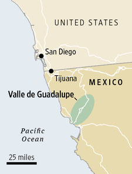
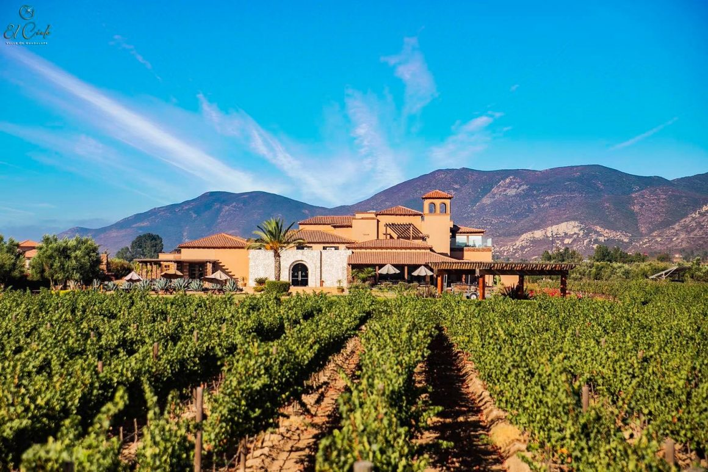
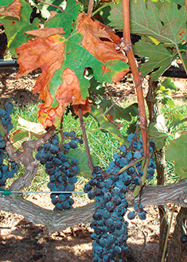

# **Grapevine Yield Estimation using Deep Learning 🍇💻** 

## **Introduction**

**Viticulture** is the process of cultivation and harvesting of **grapes**. It is one of the biggest industries in the world, since it is responsible for supplying the demand for table grapes, grape juice, raisins, and more importantly, **wine**. Being the second most popular alcoholic beverage in the world after beer, wine is a colorful, flavorful drink that has the grape as it's backbone, that moves a **\$300 billion** dollar industry worldwide.

|                       |   |
|:----------------------------------------------------------------------:|:------------------------------------: |
| ***Figure 1.**  Clusters of Merlot grapes*                       | ***Figure 2.**  A bottle and glass of wine* |

There are many wine producing regions in the world, with some of the most notable located in **Europe** and the **United States**, but if we go a little bit south of California, we can find a small zone in the municipality of **Ensenada, Baja California** in **Mexico** that supports a growing local industry dedicated to **wine making, research** and **business**. **Valle de Guadalupe** is home to more than 100 different wineries that produce over **70%** of Mexico's wine. There are many varieties of grape cultivated and harvested in Valle de Guadalupe, with the most prevalent being **Cabernet Sauvignon, Merlot, Tempranillo, Nebbiolo** and **Chenin Blanc.**

|                       |   |
|:----------------------------------------------------------------------:|:------------------------------------: |
| ***Figure 3.**  Location of Valle de Guadalupe*                       | ***Figure 4.**  A vineyard in Valle de Guadalupe (El Cielo)* |

|                       |   |
|:----------------------------------------------------------------------:|:------------------------------------: |
| ***Figure 5.**  Pierce's disease*                       | ***Figure 6.**  Red blotch disease* |

## **Project overview**

## **Objectives**
-
-
-
-

## **Project development**

## **Discussion**

## **Final remarks**
